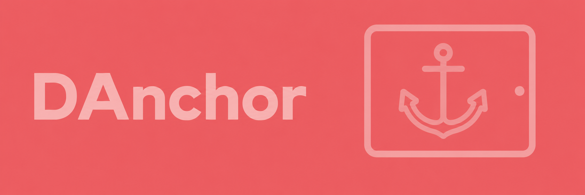
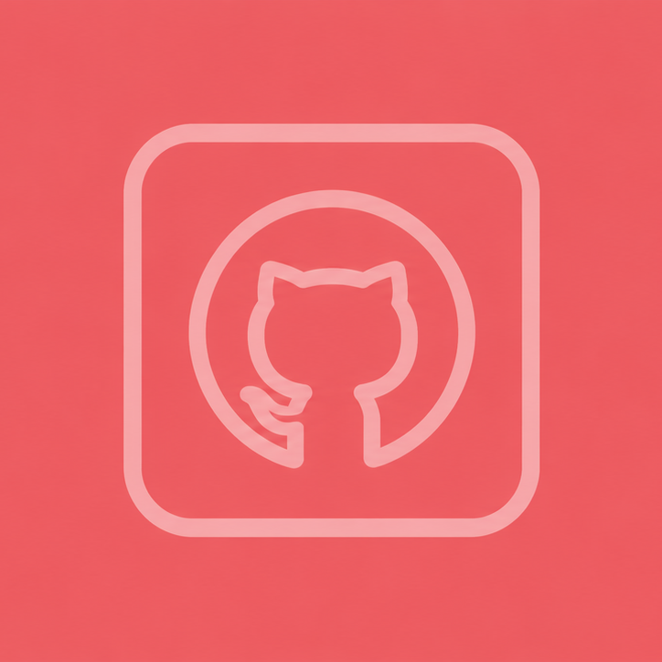
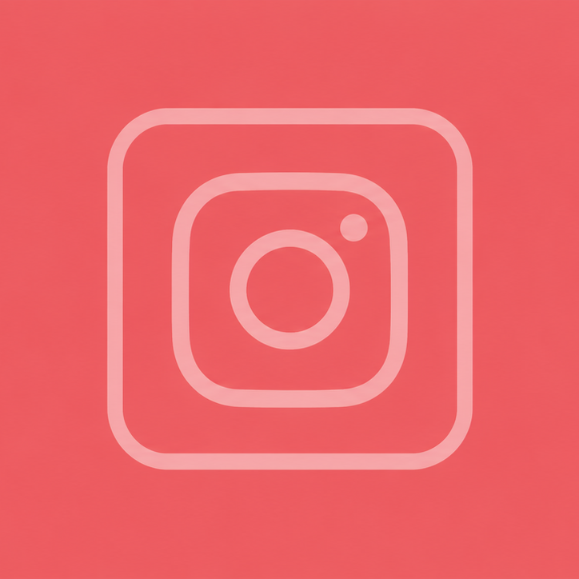
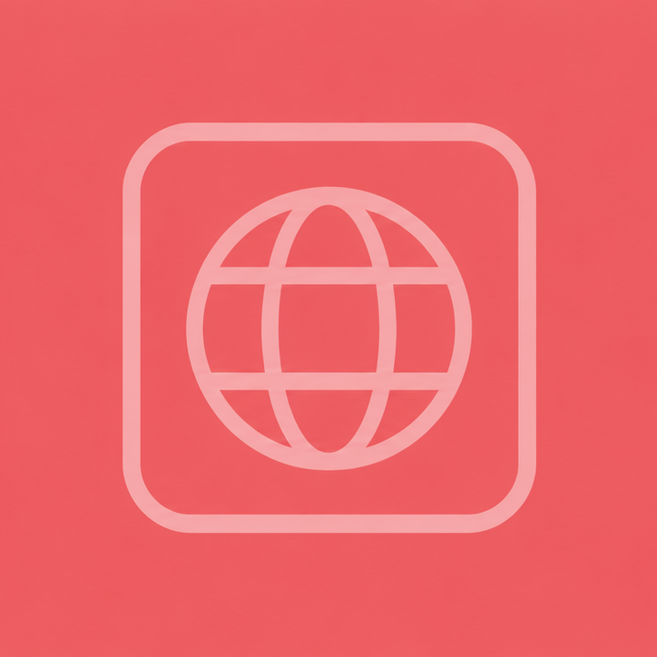

[](https://www.codefactor.io/repository/github/sirquacksalot/danchor)
[](LICENSE.md)
[](CODE_OF_CONDUCT.md)

<br>
<div align=center>

> *Drop DAnchor. Extend your Desk.*

</div>
<br>

DAnchor reimplements Apple's Sidecar for Linux, in Rust. It turns a tablet — iPad or Android — into a touch-enabled second display for a Linux desktop, streamed over network or USB with a touch input back-channel.

## The Reason Why

Moveing from Windows to linux left me with a good tool like SuperDisplay. A Simple just working solution. Being facinated with the apple integrated way of a second screen I knew I wanted the same. This is my approach with AI to make it happen.

## Planned Features

🚧 DAnchor is in early scaffolding — the workspace builds, but none of the below is implemented yet.

- **Second display over network or USB** — Stream your Linux desktop to a tablet as an additional monitor, connected over Wi-Fi or a USB cable.
- **Touch input back-channel** — Touches on the tablet are relayed back to the desktop and injected as real input events.
- **Low-latency video streaming** — Hardware-accelerated encoding; protocol still to be decided (WebRTC vs. a custom UDP transport à la Moonlight/Sunshine with VAAPI).
- **Automatic device discovery** — Find your desktop from the tablet app without typing an IP address (mDNS/Bonjour-style, mechanism TBD).
- **Native mobile apps** — SwiftUI app for iPad, Kotlin/Compose app for Android, both backed by a shared Rust core.
- **Shared core, native UI** — Streaming protocol and touch handling live once in `danchor-core`; each mobile platform keeps its own native UI, wired up via UniFFI.

## Requirements

- Rust toolchain, edition 2024 (stable, 1.85+)
- A Linux desktop to run `danchor-desktop` on
- Eventually: an iPad or Android tablet running the DAnchor mobile app (not built yet)

## Setup

```bash
git clone https://github.com/SirQuacksALot/DAnchor.git
cd DAnchor

# Build the whole workspace
cargo build --workspace

# Run the desktop binary
cargo run -p danchor-desktop
```

## Project Structure

```
DAnchor/
├── Cargo.toml              # Workspace root (resolver 2), shared package metadata
├── crates/
│   ├── danchor-core/        # Shared streaming + wire protocol logic
│   ├── danchor-desktop/     # Linux CLI/desktop app binary
│   └── danchor-ffi/         # UniFFI bindings exposing danchor-core to mobile
├── mobile/
│   ├── ios/                 # Future native SwiftUI iPad app
│   └── android/             # Future native Kotlin/Compose Android app
└── docs/                    # Project documentation
```

## Roadmap

Key architectural decisions still open:

- **Video streaming protocol** — WebRTC vs. a custom UDP transport (Moonlight/Sunshine-style) with VAAPI hardware encoding
- **Touch injection on Linux** — `uinput` vs. `evdev`
- **Device discovery** — mDNS/Bonjour-style broadcast

## License

[EUPL-1.2](LICENSE.md) — see `Cargo.toml` for workspace metadata.

<br>

<!-- [](https://github.com/SirQuacksALot/DAnchor) -->
<!--  -->
<!-- < -->

